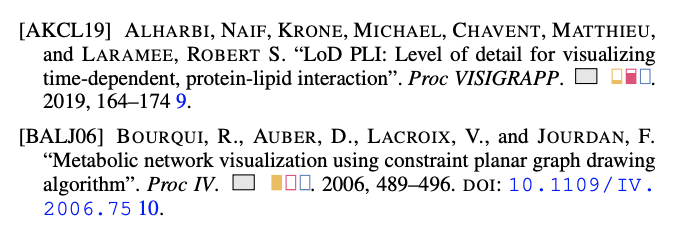

# BibChips
Latex code for bibliography with glyphs to classify properties of included literature

*Created by Laura Garrison, Juraj Palenik, and Stefan Bruckner*

Example of this in use: 

L. Garrison, I. Kolesar, I. Viola, H. Hauser, and S. Bruckner, "Trends & Opportunities in Visualization for Physiology: A Multiscale Overview," *Computer Graphics Forum*, vol. 41(3), pp. 609-643, 2022. doi: [10.1111/cgf.14575](https://onlinelibrary.wiley.com/doi/full/10.1111/cgf.14575).
